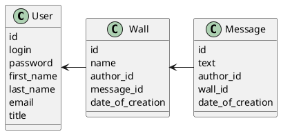

# Компонентная архитектура
<!-- Состав и взаимосвязи компонентов системы между собой и внешними системами с указанием протоколов, ключевые технологии, используемые для реализации компонентов.
Диаграмма контейнеров C4 и текстовое описание. 
-->
## Компонентная диаграмма

```plantuml
@startuml
!include https://raw.githubusercontent.com/plantuml-stdlib/C4-PlantUML/master/C4_Container.puml

AddElementTag("microService", $shape=EightSidedShape(), $bgColor="CornflowerBlue", $fontColor="white", $legendText="microservice")
AddElementTag("storage", $shape=RoundedBoxShape(), $bgColor="lightSkyBlue", $fontColor="white")

Person(user, "Пользователь")
Person(admin, "Администратор")
Person(moder, "Модератор")

System_Ext(web_site, "Клиентский веб-сайт", "HTML, CSS, JavaScript, React", "Веб-интерфейс")

System_Boundary(social_network_site, "Социальная сеть") {
  Container(auth_service, "Сервис авторизации", "C++", "Сервис управления пользователями", $tags = "microService")    
   Container(wall_service, "Сервис стены", "C++", "Сервис управления стеной пользователя", $tags = "microService") 
   Container(message_service, "Сервис сообщений", "C++", "Сервис управления сообщениями чата", $tags = "microService")   
   ContainerDb(db, "База данных", "MySQL", "Хранение данных о пользователях, стенах и сообщений в чате пользователя", $tags = "storage")
   
}

Rel(user, web_site, "Регистрация, просмотр информации на стене, отправка сообщений в чате, оставление комментариев на стене")
Rel(admin, web_site, "Назначение администраторов, назначение модераторов, модерация контента и пользователей")
Rel(moder, web_site, "Модерация контента и пользователей")


Rel(web_site, auth_service, "Работа с пользователями", "localhost/person")
Rel(auth_service, db, "INSERT/SELECT/UPDATE/DELETE", "SQL")

Rel(web_site, wall_service, "Работа со стеной", "localhost/wall")
Rel(wall_service, db, "INSERT/SELECT/UPDATE/DELETE", "SQL")

Rel(web_site, message_service, "Работа с сообщениями чата", "localhost/message")
Rel(message_service, db, "INSERT/SELECT/UPDATE/DELETE", "SQL")

@enduml
```
## Список компонентов  

### Сервис авторизации
**API**:
-	Создание нового пользователя
      - входные параметры: login, пароль, имя, фамилия, email, обращение (г-н/г-жа)
      - выходные параметры: отсутствуют
-	Поиск пользователя по логину
     - входные параметры:  login
     - выходные параметры: имя, фамилия, email, обращение (г-н/г-жа)
-	Поиск пользователя по маске имени и фамилии
     - входные параметры: маска фамилии, маска имени
     - выходные параметры: login, имя, фамилия, email, обращение (г-н/г-жа)

### Сервис стены
**API**:
- Создание стены
  - Входные параметры: название стены,  автор, сообщения на стене, дата создания
  - Выходыне параметры: индентификатор стены
- Получение списка всех сообщений на стене
  - Входные параметры: отсутствуют
  - Выходные параметры: массив с сообщениями, где для каждого указаны его идентификатор, содержание, автор и дата написания

### Сервис сообщений
**API**:
- Создание сообщений
  - Входные параметры: содержимое сообщения, автор, стена, дата создания
  - Выходные параметры: идентификатор сообщения
- Получение списка сообщений на стене
  - Входные параметры: стена
  - Выходные параметры: массив с сообщениями (идентификатор, текст сообщения, автор, дата создания)
- Получение сообщения
  - Входнае параметры: идентификатор стены
  - Выходные парамтеры: текст сообщения, автор, стена, дата создани
- Изменение сообщения
  - Входные параметры: идентификатор сообщения, текст сообщения, автор, стена, дата создания
  - Выходные параметры: отсутствуют


### Модель данных
